# Sucharu Cursors

Cursor theme for [MamoLinux][mamolinux] Based on [Capitaine Cursors][capitaine-cursors] with different [colour][colour] variations.

[mamolinux]: https://mamolinux.sourceforge.io/
[capitaine-cursors]: https://github.com/keeferrourke/capitaine-cursors
[colour]: https://github.com/mamolinux/sucharu-theme-cursor#supported-colours

This is an x-cursor theme inspired by macOS and based on KDE Breeze.
The source files were made in Inkscape, and the theme is designed to pair well with [mint-y][mint-y-theme] based themes [Sucharu][mamolinux-themes] for all colour variations.

[mint-y-theme]: https://github.com/linuxmint/mint-themes
[mamolinux-themes]: https://github.com/mamolinux/sucharu

This cursor should scale appropriately for any display resolution.

## Supported Colours

This cursor pack provide the following colours:

| Name        | Build option name   |
| :---------  | :------------------ |
| All         | (default)           |
| Aqua        | `-t Aqua`           |
| Blue        | `-t Blue`           |
| Brown       | `-t Brown`          |
| Dark/Black  | `-t Dark`           |
| Green       | `-t Green`          |
| Grey        | `-t Grey`           |
| White/Light | `-t Light`          |
| Orange      | `-t Orange`         |
| Pink        | `-t Pink`           |
| Purple      | `-t Purple`         |
| Red         | `-t Red`            |
| Sand        | `-t Sand`           |
| Teal        | `-t Teal`           |
| Yellow      | `-t Yellow`         |

## Supported DPIs

This cursor pack aims to support all [named pixel densities][named-dpi].

[named-dpi]: https://en.wikipedia.org/wiki/Pixel_density#Named_pixel_densities

| Name    | Build option name | Rendered density (DPI) | Scale          |
| :------ | :---------------- | :--------------------- | :------------- |
| LODPI   | `-d lo`           | 96-144                 | x1, 1.25, x1.5 |
| TVDPI   | `-d tv` (default) | 192                    | x2             |
| HDPI    | `-d hd`           | 240                    | x2.5           |
| XHDPI   | `-d xhd`          | 288                    | x3             |
| XXHDPI  | `-d xxhd`         | 384-480                | x4, x5         |
| XXXHDPI | `-d xxxhd`        | 576+                   | x6, x10        |

## Building from source

Building from source can take a really long time, depending on the max specified DPI.
Pre-built packages are available for download.

That said, you'll find everything you need to build and modify this cursor set in the `src/` directory.

Make sure `bc`, `inkscape` and `xcursorgen` are installed

```
sudo apt install bc inkscape x11-apps          # Debian, Ubuntu based distros
sudo dnf install bc inkscape xorg-x11-apps     # Fedora, EPEL based distros
brew cask install xquartz inkscape          # macOS
```

Then run the provided script with optional arguments:

```
./build.sh [option]
```

This will generate the pixmaps and appropriate aliases.
The freshly compiled cursor theme will be located in the `usr/` folder.

The script has a few options described below:

| Option | Values                | Description                     |
| :----- | :-------------------- | :------------------------------ |
| `-p`   | `unix`, `win32`       | Build for BSD/Linux, or Windows |
| `-t`   | See [Colours][colour] | Choose the variant to build     |
| `-d`   | See [DPIs][dpi]       | Set the max DPI to render       |

[dpi]: https://github.com/mamolinux/sucharu-theme-cursor#supported-dpis

<!-- <small>*Note: building the win32 cursors from source is not currently supported, but it is on the roadmap.</small> -->

## Pre-built binaries

Pre-built binaries for debian based systems are available for download at [GitHub](https://github.com/mamolinux/sucharu-theme-cursor/releases/latest) :heart:

## Installation

### \*NIXes, \*BSDs, and possibly others

To install the cursor theme simply copy the theme to your icons directory.
For local user installation:

```
mkdir -p ~/.icons/
cp -pr usr/share/icons/* ~/.icons/
```

For system-wide installation for all users:

```
sudo cp -pr usr/share/icons/* /usr/share/icons/
```

Then set the theme with your preferred desktop tools.

#### Fedora and EPEL

```
Coming Soon or create a PR
```

#### Arch Linux

```
Coming Soon or create a PR
```

### Windows

```
Coming Soon or create a PR
```
<!-- The Windows build comes with an INF file to make installation easy.

 1. Open `.windows/` in Explorer, and right click on `install.inf`.
 2. Click 'Install' from the context menu, and authorise the modifications to your system.
 3. Open `Control Panel` > `Personalisation and Appearance` > `Change mouse pointers`, and select Capitaine cursors.
 4. Click 'Apply'. -->

## License

Sucharu cursors is based on KDE Breeze cursors and Capitaine cursors, as such it falls under the same license.
Sucharu cursors is LGPLv3. See COPYING for more details.

## Preview

| Aqua                  | Blue                  |
| --------------------- | --------------------- |
| 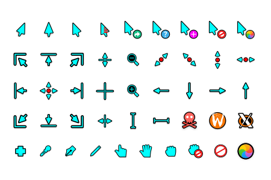 | 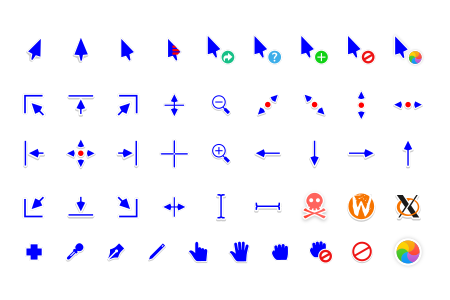 |

| Brown                  | Dark/Black            |
| ---------------------- | --------------------- |
| 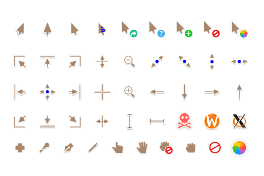 | 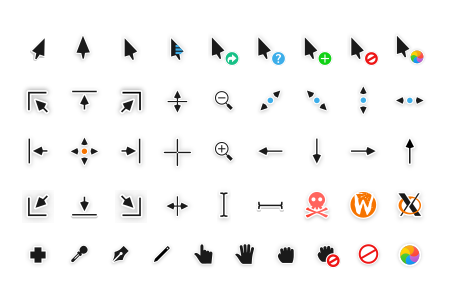 |

| Green                  | Grey                  |
| ---------------------- | --------------------- |
| 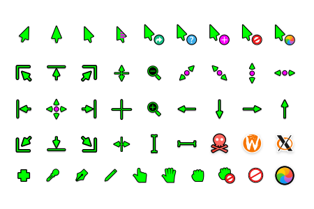 | 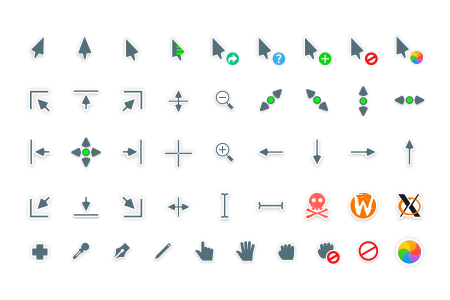 |

| Light/White            | Orange                  |
| ---------------------- | ----------------------- |
| 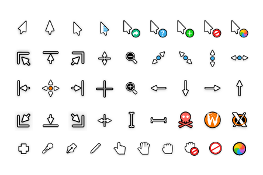 | 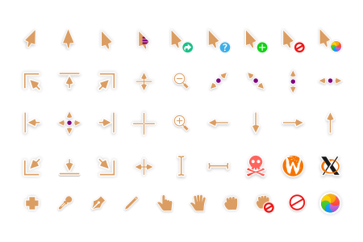 |

| Pink                  | Purple                  |
| --------------------- | ----------------------- |
| 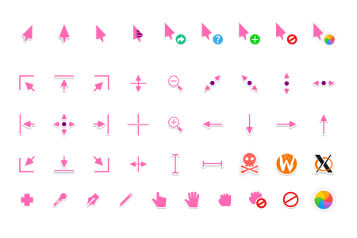 | 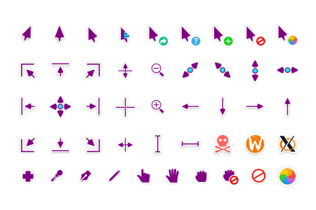 |

| Red                  | Sand                  |
| -------------------- | --------------------- |
| 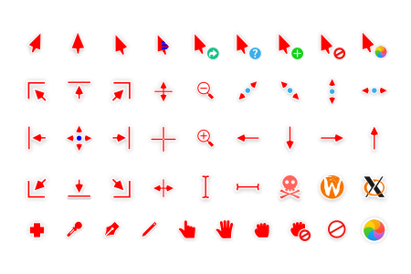 | 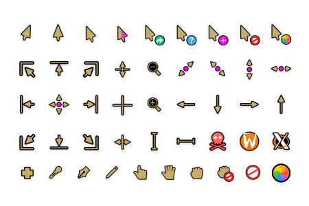 |

| Teal                  | Yellow                  |
| --------------------- | ----------------------- |
| 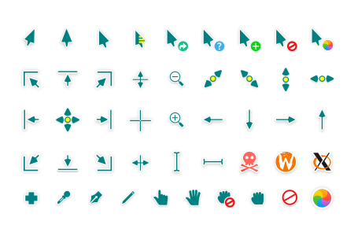 | 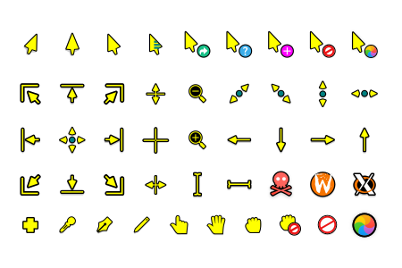 |

## Contributors

### [Himadri Sekhar Basu](https://github.com/hsbasu)

### [Keefer Rourke](https://github.com/keeferrourke)

He is the original creator of Capitaine cursors.

## Donations

## Known issues
1. [x] xcursorgen throws some warnings during processing.